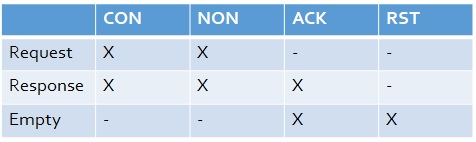
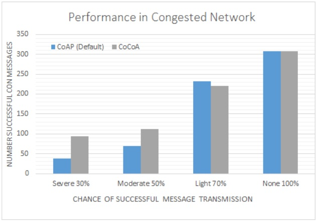

# CoAP-CoCoA
This project implements variable congestion control to the CoAP IoT protocol.

CoAP is an Internet application protocol for constrained nodes.
The interaction model is similar to client/server model of HTTP with requests and responses. 
However, machine-to-machine interactions result in nodes acting in both client and server roles.
In the network stack, CoAP rests on top of UDP.
CoAP methods resemble HTTP method requests and responses.

CoAP uses messages to provide reliable UDP messaging.
Request and response are carried in CoAP messages
There are 4 message types which is indicated by the value in 2 bit T in CoAP header.

When a Confirmable message (CON) is sent, it maintains an internal state for timeout and a counter.
When timeout reaches 0 with no ACK, the counter is incremented and the Confirmable message (CON) is retransmitted with an increased timeout. This loops while the counter is less than MAX_RETRANSMIT.
At this point, the sender gives up.

Since CoAP operates on top of UDP, CoAP must handle congestion control by itself.
CoAP in RFC7252 describes increasing timeout by constant factor of 2. 
This basic congestion control mechanism is not capable of adapting to network conditions.
This project modifies the CoAP implementation in ContikiOS and implements a variable backoff timer.

CoCoA is short for advanced congestion control for CoAP.

By simulating a busy network, we see improved average performance of implementing CoCoA.

## INSTRUCTIONS ##
1) Get Contiki3.0 http://www.contiki-os.org/download.html
2) Using your VM VirtualBox, open Contiki image 
3) Replace inside `/contiki/apps/er-coap` with .h and .c files from this repo
4) `cd /contiki/tools/cooja` and enter `ant run`
5) Load simulation file cocoa.csc.
6) Enable server socket. Right click node in Cooja.
Go to Mote Tools for Cooja 7 -> Serial Socket (SERVER) and set Listen port to X. Start it.
7) `cd /contiki/examples/ipv6/rpl-border-router` and enter `make connect-router-cooja`
8) Serial socket (SERVER) window should say connected.
